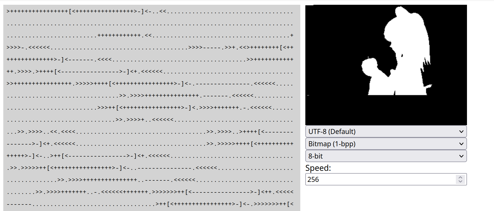

# bf_interpreter
 Brainfuck interpreter written in svelte that allows you to switch output encodings. 
## Why make another web Brainfuck interpreter?

In one sentence. Other Brainfuck web interpreters don't define or are even aware of what codepage they use. Which causes strange and undefined behavior. 

Most online Brainfuck interpreters assume that the input and output are in 7-bit Ascii. So writing anything 0x80 and above causes some strange behavior. Most online brainfuck interpreters implement the `.` command like.

	if (command == '.'){
		WriteToScreen(String.fromCharCode(tape[head]));
	}

And the write command is 

	if (command == ','){
		tape[head]=input_buffer.charCodeAt();
		input_buffer=input_buffer.slice(1);
	}

I can go on an entire rant about how bad `String.fromCharCode` is and how you shouldn't use it as a "Convert to character" function and instead use `String.fromCodePoint`. But in this specific case neither function is what I'd consider "correct". Because they expect a UTF-16 Code or a Unicode codepoint respectively when the programmer most meant to output an Ascii character (A printable Ascii character to be specific). This means anything that isn't an Ascii character is going to cause at the very least unintended behavior. Here's a program as an example

	+[.+]

This program prints every character from 0x01 to 0xff (or 0xffff on 16-bit implementations). 0x20-0x7e are all expected output, the rest is a free for all. If the output function is implemented as above it usually prints the first 256 unicode characters. Also known as ISO-8859-1 or colloquially "ANSI". But if the tape is implemented as **signed** integers, `String.fromCharCode` prints characters U+FFFF to U+FF80 (Which are a bunch of pretty much useless compatibility characters) and `String.fromCodePoint` throws (Which is probably a better idea when recieving a negative number). Though I have seen online interpreters span the whole range of behaviors of "what to do when outputting something that isn't ASCII". 

The more problematic example program is the following

	,[.-]

Most brainfuck implementations assume `,` will only return a character that will fit in a byte. If you input a character that isn't in ISO-8859-1 it will try to write a 16 bit value to a cell that's only supposed to have an 8-bit value. Sometimes the interpreter clamps, wraps or otherwise sanitizes the input (Sometimes by design, sometimes because the implementation uses a Uint8Array). But sometimes it just absentmindedly puts a 16-bit value into the cell which you can freely increment and/or decrement. (Sometimes decrementing works but incrementing doesn't because the programmer only checks for underflow when decrementing, not overflow). And now that you have a 16-bit value things really break. The program above just starts printing all the codepoints beforehand which might break other stuff. Though theoretically you can do with this whatever you want. Including potentially incrementing it all the way to Number.MAX_SAFE_INTEGER. 

## What you probably meant to do. 

Most people are probably fine with outputting ISO-8859-1. After all, that's what the original 1993 Brainfuck by Urban Müller outputted. But some people read the [UTF-8 Everywhere](utf8everywhere.org) and decided that's unacceptable and want their joke interpreter to use state of the art 1989 Unicode handling.

Well if you want ISO-8859-1 all you have to do is sanitize the input and you're golden. If you want UTF-8 it's slightly more complicated but not too complicated. 

	if (command == '.'){
		output_buffer.append(tape[tape_head]);

	}
	if (command == ',' ){
		if (input_buffer_bytes.length == 0 ) {
			input_buffer_bytes.concat(new TextEncoder().encode(input_buffer));
		}
		tape[tape_head]=input_buffer_bytes[0];
		input_buffer_bytes=input_buffer_bytes.slice(1);
	}

	/* more code */

	/* WriteToScreen now needs to clear whatever output you have on screen */
	WriteToScreen(new TextDecoder().decoder(output_buffer));

Javascript gives you the TextEncoder and TextDecoder classes for UTF-8. The code is a bit longer because you can't output the character to the screen immediately but have to accumulate it in a buffer in case there are more input bytes. Other than that the code is self explanatory.

## What I did

Well I wasn't content with picking either ISO-8859-1 or UTF-8. Brainfuck has existed for 32 years at this point and people probably wrote programs on many different codepages. Sadly, while TextDecoder supports several legacy codepages TextEncoder does not. Luckily [the codepage package](https://www.npmjs.com/package/codepage) could do that heavy lifting for me. 

Then I went a bit overboard. I added ANSI Escape Code support using another library. Allowed you to output arbitrary HTML (Be careful of XSS attacks). And then I remembered this strange guy in a Discord server I am in. Let's call him J. Now J is a smart dude, but has a lot of bat guano ideas about computers and put little to no thought into them. One of his madnesses is that strings will eventually fall out of favor and be replaced with software directly writing bitmap data to surfaces. This is problematic to several obvious reasons but the idea stuck with me. So... There is now a 1bpp and 32bpp canvas you can write packed byte data to. After all... Brainfuck just outputs bytes, why make it necessarily text. The bitmap canvas is 320x240 in size and you can't change the size, you have to pad the image data to 320x240. 1-bpp mode uses packed bytes where every write is 8 pixels (or 16 pixels in 16 bit mode) while 32-bpp mode uses 4 byte writes in 8 and 16-bit cell widths and in bigint mode each write is an entire pixel.

